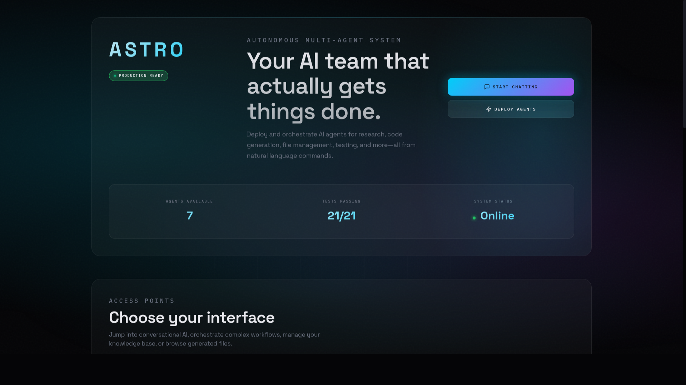

# ASTRO Ultimate System v1.0.0

[](https://github.com/Senpai-Sama7/Astro/actions/workflows/ci.yml)
[](https://nodejs.org/)
[](https://www.typescriptlang.org/)
[](https://opensource.org/licenses/MIT)
[](./tests)
[](./coverage)

---

## 🎯 Four Layers of AI Orchestration

| Layer | Name | Description | Status |
|-------|------|-------------|--------|
| A | **ASTRO** | Tool orchestration, agent management, execution engine | ✅ Active |
| B | **OTIS** | RBAC security, CVaR risk scoring, audit logging | ✅ Active |
| C | **C0Di3** | Threat management, MITRE ATT&CK, incident tracking | ✅ Active |
| D | **ARIA** | Natural language conversation interface | ✅ Active |

---

## 🖥️ Screenshots

### Homepage (Online)


### Chat Interface


---

## 🚀 Quick Start

```bash
# Clone & install
git clone https://github.com/Senpai-Sama7/Astro.git
cd Astro && npm install

# Create .env from example
cp .env.example .env

# Build & start
npm run build && npm start

# Server: http://localhost:5000
# Web UI: serve ./web on port 8080
```

---

## 🎤 API Endpoints

### Authentication
```bash
# Get dev token
curl -X POST http://localhost:5000/api/v1/auth/dev-token \
  -H "Content-Type: application/json" \
  -d '{"userId": "test", "role": "admin"}'
```

### Chat (Layer D - ARIA)
```bash
curl -X POST http://localhost:5000/api/v1/aria/chat \
  -H "Authorization: Bearer <TOKEN>" \
  -H "Content-Type: application/json" \
  -d '{"message": "help"}'
```

### Available Endpoints
| Endpoint | Method | Description |
|----------|--------|-------------|
| `/api/v1/health` | GET | Health check |
| `/api/v1/version` | GET | Version & layer status |
| `/api/v1/auth/dev-token` | POST | Issue dev JWT |
| `/api/v1/aria/chat` | POST | Chat interface |
| `/api/v1/aria/examples` | GET | Command examples |
| `/api/v1/astro/agents` | GET | List agents |
| `/api/v1/astro/tools` | GET | List tools |
| `/api/v1/astro/execute` | POST | Execute tool |

---

## 🤖 Agents & Tools

### Specialized Agents
| Agent | Tools | Purpose |
|-------|-------|---------|
| Research Agent | web_search, content_extract, http_request | Web research & summarization |
| Code Agent | echo, math_eval | Code generation & debugging |
| FileSystem Agent | read_file, write_file, list_dir | File operations (sandboxed) |
| Git Agent | git_status, git_diff | Version control |
| Test Agent | run_tests | Test execution (pytest, npm) |
| Analysis Agent | lint_code | Static analysis (eslint, pylint) |
| Knowledge Agent | save_knowledge, retrieve_knowledge | Semantic memory |
| General Assistant | echo, http_request, math_eval | General tasks |
| Math Agent | math_eval | Calculations |
| Echo Agent | echo | Testing/debugging |

### Available Tools (12 total)
| Tool | Description |
|------|-------------|
| `echo` | Returns input as-is (testing) |
| `http_request` | HTTP requests to whitelisted domains |
| `math_eval` | Mathematical expression evaluation |
| `web_search` | DuckDuckGo web search |
| `content_extract` | Extract text from URLs |
| `read_file` | Read files (workspace sandboxed) |
| `write_file` | Write files (workspace sandboxed) |
| `list_dir` | List directory contents |
| `git_status` | Git repository status |
| `git_diff` | Git diff output |
| `run_tests` | Execute test suites |
| `lint_code` | Run linters on code |
| `save_knowledge` | Persist key-value data |
| `retrieve_knowledge` | Retrieve stored data |

---

## 🛡️ Security (Layer B - OTIS)

### RBAC Roles
| Role | Permissions |
|------|-------------|
| admin | All operations |
| blue-team | Register tools, execute, view audit |
| red-team | Register tools, execute (higher risk) |
| analyst | Execute tools, view audit |
| read-only | View audit logs only |
| guest | No permissions |

### Risk Scoring (CVaR)
- Actions with risk score ≥ 0.5 require approval
- Audit trail with HMAC-SHA256 signatures
- Tamper detection and integrity verification

---

## 📊 Test Coverage

```bash
npm test          # Run all tests
npm run coverage  # Coverage report
```

| Metric | Coverage |
|--------|----------|
| Statements | 85.53% ✅ |
| Branches | 73.15% ✅ |
| Functions | 85.61% ✅ |
| Lines | 85.97% ✅ |

**Total: 173 tests passing**

---

## 🐳 Docker

```bash
npm run docker:build:core
docker run -p 5000:5000 ultimate-system:latest
```

---

## 📁 Project Structure

```
Astro/
├── src/
│   ├── astro/          # Layer A: Orchestration
│   │   ├── agents.ts   # 10 specialized agents
│   │   ├── tools.ts    # 12 tool implementations
│   │   └── orchestrator.ts
│   ├── otis/           # Layer B: Security
│   ├── codi3/          # Layer C: Intelligence
│   ├── aria/           # Layer D: Conversation
│   ├── middleware/     # Auth middleware
│   ├── services/       # Storage, logging
│   └── index.ts        # Entry point
├── web/                # Frontend UI
├── tests/              # Test suites (173 tests)
├── screenshots/        # UI screenshots
└── astro_os/           # Python TUI (experimental)
```

---

## 🔧 Development

```bash
npm run dev           # Dev server with hot reload
npm run lint          # Lint code
npm run format        # Format code
npm run type-check    # TypeScript check
```

---

## ✅ Completed Features

- [x] 7 specialized agents (Research, Code, FileSystem, Git, Test, Analysis, Knowledge)
- [x] 12 tool implementations
- [x] Frontend-backend API integration
- [x] Test coverage at 85%+
- [x] Enhanced Python TUI with status bar and agent cards

## 📋 Roadmap

- [ ] Add WebSocket support for real-time updates
- [ ] Implement streaming responses
- [ ] Add more tool integrations
- [ ] Production deployment guide

---

## 📝 License

MIT License - see [LICENSE](./LICENSE)

---

**Built with TypeScript, Express, and ❤️**
